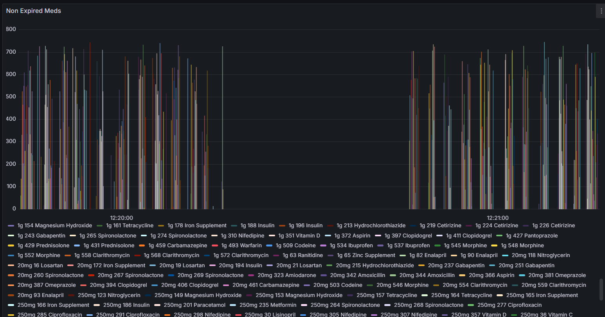

## Description

A medicine inventory tracker that manages medicines, tracks quantities, and monitors expiry dates via a REST API, using MySQL and fully containerized with Docker.

Integrates with **AWS** for storage, email notifications, monitoring, and visualization of metrics in **Grafana** via **CloudWatch**.

---
## Technologies
- Java 25 & Spring Boot (with Hibernate)
- Maven
- MySQL 
- Docker
- Terraform
- AWS (S3, SES, CloudWatch, Grafana)
- Kubernetes (Planned)
- GitHub Actions (Planned)

---
## Structure
- REST API with a service-based architecture
- Organized into controllers, services, repository, and entity/model layers
- MySQL database

---
## Core Features (Local)
- **CRUD Operations**
    - Add a medicine
    - List all medicines
    - Update quantity
    - Delete medicine
- **Expiry Tracking**
    - Show items expiring in X days
    - Show expired medicines
    - Show valid/non-expired medicines

---
## Docker Setup
- Database container (MySQL)
- Application container (Spring Boot)
- Build and run stages with Docker
- Docker Compose for orchestration

## Cloud Features
- **AWS Services**
  - S3 for storage of the medicine inventory data as csv files
  - SES for sending email notifications about medicines expiring soon
  - CloudWatch and Grafana for monitoring expiry metrics
  
### Grafana Dashboard

- **Terraform: Infrastructure as Code (IaC)**
  - used to define, create, and manage all AWS resources
  
## Testing
- Unit tests for service layer
- Unit tests for AWS services and functions
